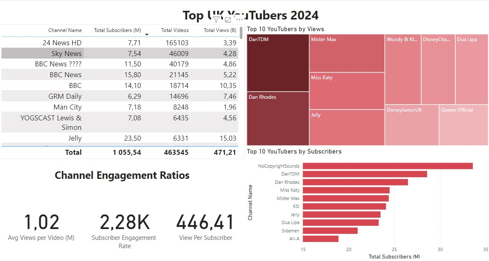

# Data Porftolio

Welcome to my portfolio website :)! 

# Table of contents

- [Objective](#objective)
- [Data Source](#data-source)
- [Stages](#Stages)
- [Design](#design)
  - [Mockup](#mockup)
  - [Tools](#tools)
- [Development](#development)
  - [Pseudocode](#pseudocode)
  - [Data Exploration](#data-exploration)
  - [Data Cleaning](#data-cleaning)
  - [Transform the Data](#transform-the-data)
  - [Create the SQL View](#create-the-sql-view)
- [Testing](#testing)
  - [Data Quality Tests](#data-quality-tests)
- [Visualization](#visualization)
  - [Results](#results)
  - [DAX Measures](#dax-measures)
- [Analysis](#analysis)
  - [Findings](#findings)
  - [Validation](#validation)
  - [Discovery](#discovery)
- [Recommendations](#recommendations)
  - [Potential ROI](#potential-roi)
  - [Potential Courses of Actions](#potential-courses-of-actions)
- [Conclusion](#conclusion)
  - [Potential Courses of Actions](#potential-courses-of-actions)
- [Conclusion](#conclusion)

  
# Objective

  Head Marketing to decide who are the top YouTubers in 2024 and verify which ones would be best ones to run their marketing campaings through the next year.

  The solution will be to create a dashboard which will provide insights into YouTubers metrics, such as:
  - Total subscriber count,
  - Total views,
  - Total videos,
  - Engagement metrics.

This data will be helpful for marketing team to make informed decisions about further collaboration with the YouTubers.

# Data Source

Data has been sourced from Kaggle (an Excel extract: https://www.kaggle.com/datasets/bhavyadhingra00020/top-100-social-media-influencers-2024-countrywise?resource=download)

# Stages

- Design,
- Development,
- Testing,
- Analysis.

# Design

Data Visuals that can be helpful to determine client needs:

## Dashboard mockup

1. Table
2. Treemap
3. Scorecards
4. Horizontal bar chart



## Tools

| Tool | Purpose |
| --- | ---|
| Excel | Exploring the data |
| SQL Server | Cleaning, testing, analyzing data |
| PowerBI | Visualizing the data via interactive dashboards |
| GitHub | Hosting the project documentation and version control |
| Mokkup AI | Designing the wireframe/mockup of the dashboard |

# Development 

More less approach from start to finish:

1. Get the Data
2. Explore the data in Excel
3. Lead the data into SQL Server
4. Clean the data with SQL
5. Test the data with SQL
6. Visualize the data in Power BI
7. Generate the fidings based on the insights
8. Write the documentation + commentary
9. Publish the data to GitHub pages

## Transform the data 

```sql
/*
# 1. Select the required columns
# 2. Extract the channel name from the 'NOMBRE' column
*/

-- 1.
SELECT
    SUBSTRING(NOMBRE, 1, CHARINDEX('@', NOMBRE) -1) AS channel_name,  -- 2.
    total_subscribers,
    total_views,
    total_videos

FROM
    top_uk_youtubers_2024
```

### Create the SQL view

```sql

/*
# 1. Create a view to store the transformed data
# 2. Cast the extracted channel name as VARCHAR(100)
# 3. Select the required columns from the top_uk_youtubers_2024 SQL table 
*/

-- 1.
CREATE VIEW view_uk_youtubers_2024 AS

-- 2.
SELECT
    CAST(SUBSTRING(NOMBRE, 1, CHARINDEX('@', NOMBRE) -1) AS VARCHAR(100)) AS channel_name, -- 2. 
    total_subscribers,
    total_views,
    total_videos

-- 3.
FROM
    top_uk_youtubers_2024

```

# Testing

Data quality tests conducted:

## Row count check

```sql

/*
# Count the total number of records

*/

SELECT
  COUNT(*) AS no_of_rows
FROM
  view_uk_youtubers_2024;

```

## Column Count check

```sql

/*
# Count the total number of columns (or fields) are in the SQL view
*/


SELECT
    COUNT(*) AS column_count
FROM
    INFORMATION_SCHEMA.COLUMNS
WHERE
    TABLE_NAME = 'view_uk_youtubers_2024'

```

## Data type check

```sql
/*
# Check the data types of each column from the view by checking the INFORMATION SCHEMA view
*/

-- 1.
SELECT
    COLUMN_NAME,
    DATA_TYPE
FROM
    INFORMATION_SCHEMA.COLUMNS
WHERE
    TABLE_NAME = 'view_uk_youtubers_2024';

```

## Duplicate count check

```sql

SELECT
    channel_name,
    COUNT(*) AS duplicate_count
FROM
    view_uk_youtubers_2024

-- 2.
GROUP BY
    channel_name

-- 3.
HAVING
    COUNT(*) > 1;

```

# DAX Measures

## 1.Total Subscribers (M)

```sql

Total Subscribers (M) = 
VAR million = 1000000
VAR sumOfSubscribers = SUM (view_uk_youtubers_2024[total_subscribers])
VAR totalSubscribers = DIVIDE(sumOfSubscribers, million)

Return totalSubscribers

```

## 2.Total Views (B)

```sql

Total Views (B) = 
VAR billion = 1000000000
VAR sumOfTotalViews = SUM(view_uk_youtubers_2024[total_views])
VAR totalViews = DIVIDE(sumOfTotalViews, billion)

RETURN totalViews

```

## 3.Total Videos

```sql

Total Videos = 
VAR totalVideos = SUM(view_uk_youtubers_2024[total_videos])

RETURN totalVideos

```

## 4.Average Views Per Video (M)

```sql
Avg Views per Video (M) = 
VAR sumOfTotalViews = SUM (view_uk_youtubers_2024[total_views])
VAR sumOfTotalVideos = SUM(view_uk_youtubers_2024[total_videos])
VAR avgOfViewsPerVideo = DIVIDE(sumOfTotalViews, sumOfTotalVideos, BLANK())
VAR finalAvgViewsPerVideo = DIVIDE(avgOfViewsPerVideo, 1000000, BLANK())

RETURN finalAvgViewsPerVideo

```

## 5. Subscriber Engagement Rate

```sql

Subscriber Engagement Rate = 
VAR sumOfTotalSubscribers = SUM(view_uk_youtubers_2024[total_subscribers])
VAR sumOfTotalVideos = SUM(view_uk_youtubers_2024[total_videos])
VAR subscriberEngRate = DIVIDE(sumOfTotalSubscribers, sumOfTotalVideos, BLANK())

RETURN subscriberEngRate

```
## 6.Views per subscriber

```sql

View Per Subscriber = 
VAR sumOfTotalViews = SUM(view_uk_youtubers_2024[total_views])
VAR sumOfTotalSubscribers = SUM(view_uk_youtubers_2024[total_subscribers])
VAR viewsPerSubscriber = DIVIDE(sumOfTotalViews, sumOfTotalSubscribers, BLANK())

RETURN viewsPerSubscriber

```

# Analysis

## Outcome

Main points that where targeted for the client:

1. Top 10 YouTubers with most subscribers.
2. Top 3 channels with most videos uploaded.
3. Top 3 channels with the most views.
4. Top 3 channels with highest avg views per video.
5. Top 3 channels with the highest views per subsriber ratio.
6. Top 3 channels with the highest subscriber engagement rate per video uploaded.


### Top 10 youtubers with the most subscribers.

| Rank | Channel Name         | Subscribers (M) |
|------|----------------------|-----------------|
| 1    | NoCopyrightSounds    | 33.60           |
| 2    | DanTDM               | 28.60           |
| 3    | Dan Rhodes           | 26.50           |
| 4    | Miss Katy            | 24.50           |
| 5    | Mister Max           | 24.40           |
| 6    | KSI                  | 24.10           |
| 7    | Jelly                | 23.50           |
| 8    | Dua Lipa             | 23.30           |
| 9    | Sidemen              | 21.00           |
| 10   | Ali-A                | 18.90           |

### Top 3 channels with the most videos.

| Rank | Channel Name         | Videos Uploaded |
|------|----------------------|-----------------|
| 1    | GRM Daily            | 14,696          |
| 2    | Manchester City      | 8,248           |
| 3    | Yogscast             | 6,435           |
